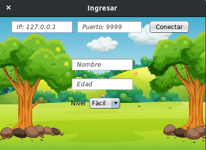
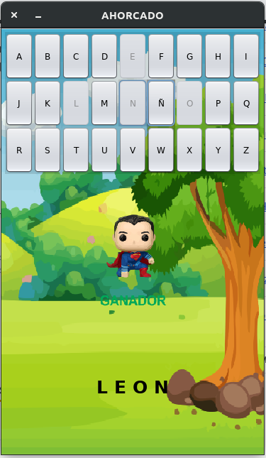
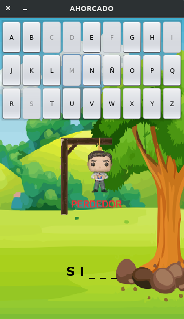

# Ahorcado
Examen de primer parcial.

Realizado para Sistema Operativo Linux con NetBeans 8.2 

Ejecutar el Servidor y posteriormente el Cliente

**Elaborado por:**

Amador Nava Miguel Ángel

**Intefaz de conexión con el Servidor**

**Intefaz del juego**

