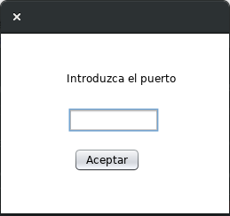
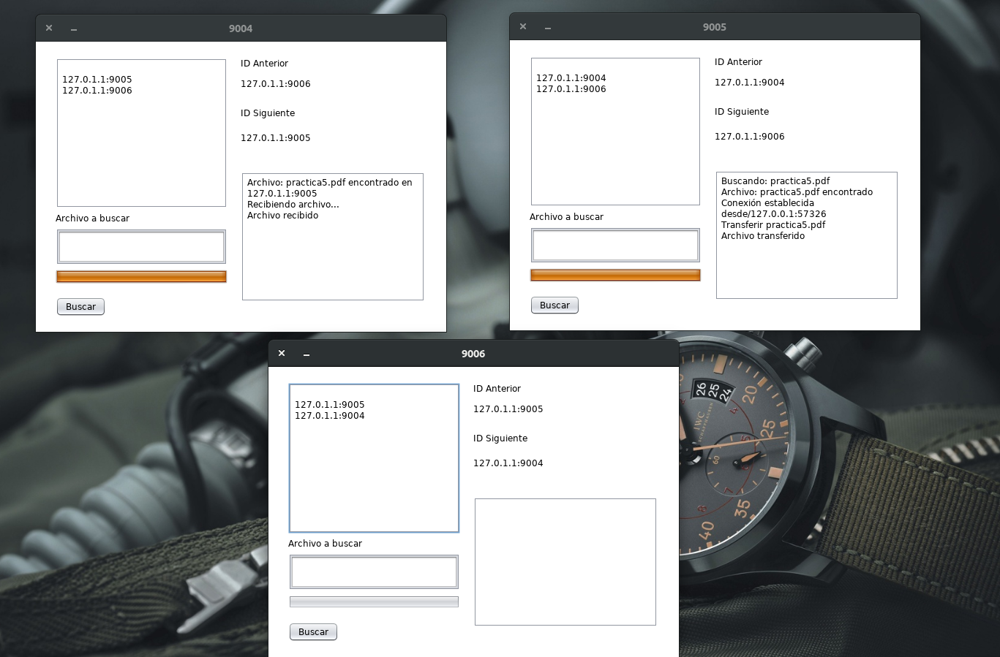

# Busqueda de archivos en topología de anillo

Realizado en Ubuntu con NetBeans 8.2 

Se crea de manera dinámica una topología de anillo (el último nodo se conecta el primero) con sockets multicast, cada nodo tiene su propia carpeta donde al solicitar un archivo se busca en esa carpeta, la solicitud se hace con sockets de datagrama. Si el archivo que se solicita es encontrado en algún nodo, a través de sockets de flujo se hace la transferencia.

**Elaborado por:**

Amador Nava Miguel Ángel

**Interfaz de inicio**

**Intefaz solicitar un archivo**

