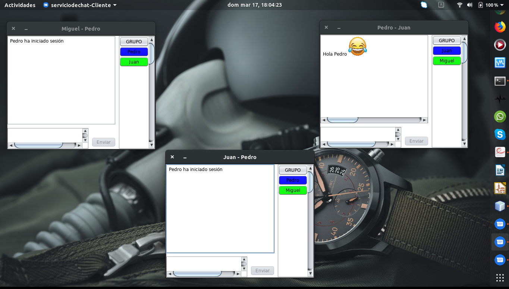

# Chat con Sockets Multidifusión

Realizado en Ubuntu con NetBeans 8.2 

Servicio de chat haciendo uso de sockets de
datagrama, así como sockets de multidifusión.

**Elaborado por:**

Amador Nava Miguel Ángel

**Intefaz de conexión con los demás clientes**

**Intefaz para enviar mensajes**

**Mensajes al Grupo**

**Mensaje privado**

