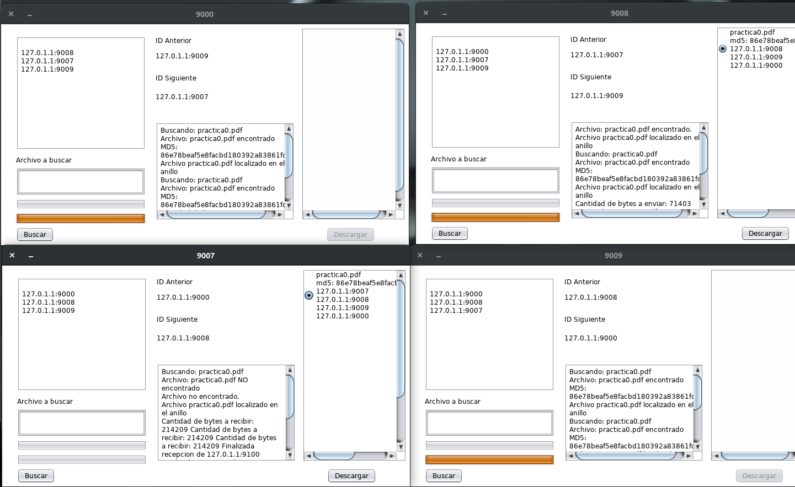
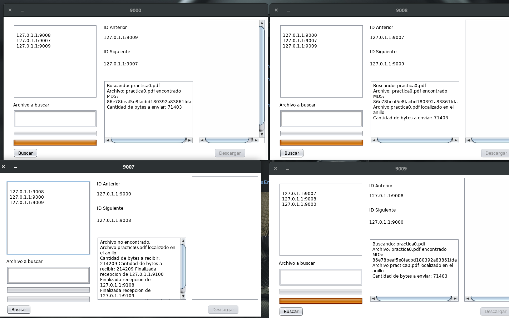

# Aplicación distribuida para busqueda de archivos

Realizado en Ubuntu con NetBeans 8.2 

La aplicación crea un anillo de manera dinámica. Cuando se solicita un archivo y lo encuentra, verifica si es igual con el algoritmo MD5, posteriormente muestra al usuario las distintas opciones de descarga, para ser descargado de manera distribuida mediante RMI.

Más información leer: Requisitos.pdf

**Elaborado por:**

Amador Nava Miguel Ángel

**Interfaz de usuario**

