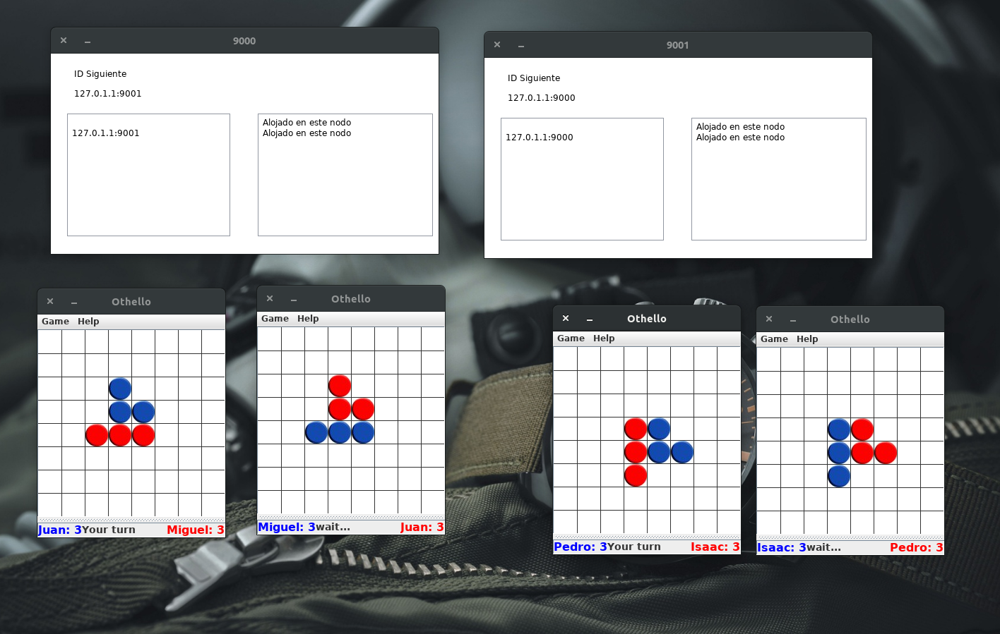
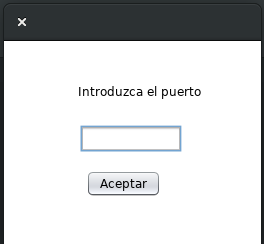
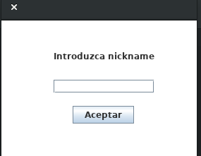

# Juego de Othello

Realizado en Ubuntu con NetBeans 8.2 

Iniciar los sevidores empezando con el puerto 9000. (Vista.java) 
Los servidores se comunican y se reestructuran a través de mensajes multicast cuando se conecta o desconecta uno nuevo.
Los clientes se conectan a los servidores y estos acoplan los juegos mediante mensajes de datagrama, si un juegador se desconecta el servidor le busca otro oponente. (Othello.java)
Una vez iniciado el juego la comunicacón es con mensajes de flujo.

Más información leer: Requisitos.pdf

**Elaborado por:**

Amador Nava Miguel Ángel

**Interfaces del juego**

**Intefaz para iniciar los servidores**

**Intefaz para iniciar los clientes**

